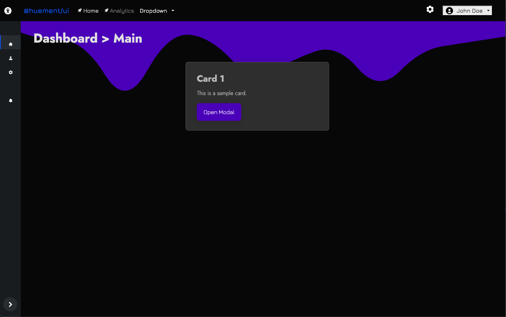

<h1 align="center">
   
  
   
</h1>

> @huement/ui dashboard template. Uses Bootstrap 5, SCSS, and minimal vanilla JS. Easily adapted into a project 

---

### PREVIEW

Here is a quick preview showing off the 3 different content areas, left side menu, main content area, and then an offcanvas right side menu that toggles open and close. The main sidebar menu also toggles to a smaller icon only mode. 

 

 

 

### ONGOING

This is a very new project and *hopefully* will get expanded upon soon. It is very minminal and is geared towards being adapted into a larger project.